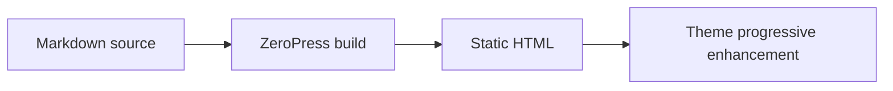

# ZeroPress Theme Authoring

ZeroPress themes are static template packages for the current `runtime: "0.5"` contract.

A theme decides how ZeroPress content looks and behaves in the browser. The build pipeline prepares structured data, renders Markdown content, resolves widgets, copies theme assets, and emits static output. The theme owns the HTML templates, CSS, and optional client-side enhancement.

## What A Theme Contains

A minimal theme directory contains:

```txt
my-theme/
  theme.json
  layout.html
  index.html
  post.html
  page.html
  assets/
    style.css
```

Common optional files:

```txt
my-theme/
  archive.html
  category.html
  tag.html
  404.html
  partials/
    *.html
  assets/
    theme.js
```

Required files for a usable v0.5 theme:

- `theme.json`
- `layout.html`
- `index.html`
- `post.html`
- `page.html`
- `assets/style.css`

## ZeroPress Site Shape

When creating a complete ZeroPress site, the practical authoring unit is:

```txt
my-site/
  preview-data.json
  theme/
    theme.json
    layout.html
    index.html
    post.html
    page.html
    partials/
      tracker.html
      content-enhancements.html
    assets/
      style.css
      theme.js
  public/
    favicon.ico
    vendor/
```

- `preview-data.json` defines site data, content, menus, widgets, and permalink policy.
- `theme/` defines deterministic rendering through the v0.5 theme runtime.
- `theme/assets/` contains theme-owned CSS and JavaScript referenced by the theme.
- `public/` contains site-owned passthrough files such as favicons, PDFs, source files, and third-party vendor assets.

Files under `theme/assets/` are copied to output `/assets/`. When asset hashing is enabled, output filenames may include a content hash and references such as `/assets/style.css` are rewritten to the emitted hashed path. Use that directory for reusable theme CSS, JavaScript, icons, and decorative images. Use `public/` for site content media, vendor bundles, and files the site owner controls directly.

Favicon files are site-owned head metadata, not reusable theme assets. CLI build wrappers can auto-discover root-level public files named `favicon.ico`, `favicon.svg`, `favicon.png`, and `apple-touch-icon.png` and inject the corresponding `<link>` tags. Sites generated by an admin or another tool may instead provide explicit preview-data `site.favicon` URLs.

Reusable themes should avoid hard-coding site-specific analytics tokens, vendor URLs, or product copy. Prefer a documented partial or `public/` integration point that a site owner can fill.

## `theme.json`

The theme manifest identifies the package and declares the v0.5 runtime.

```json
{
  "$schema": "./theme.v0.5.runtime.schema.json",
  "name": "My Theme",
  "namespace": "your-namespace",
  "slug": "my-theme",
  "version": "0.5.0",
  "license": "MIT",
  "runtime": "0.5",
  "description": "Short summary of the theme.",
  "features": {
    "comments": true,
    "newsletter": true,
    "postIndex": true
  },
  "menuSlots": {
    "primary": {
      "title": "Primary Menu",
      "description": "Main navigation menu"
    }
  },
  "widgetAreas": {
    "sidebar": {
      "title": "Sidebar Widgets",
      "description": "Sidebar widget area"
    }
  }
}
```

The current runtime accepts only `runtime: "0.5"`. There is no fallback to older theme runtimes.

Use the [Theme Manifest Runtime v0.5 schema](/schemas/theme.v0.5.runtime.schema.json) as the source of truth for manifest fields.

## Templates And Partials

ZeroPress renders one route template inside `layout.html`.

- `layout.html` defines the shared document shell.
- `index.html` renders the front page, post index, or combined default root route.
- `post.html` renders an individual post.
- `page.html` renders an individual page.
- `archive.html`, `category.html`, `tag.html`, and `404.html` are optional route templates.
- `partials/*.html` are reusable template fragments.

The layout must include the content slot:

```html
<main>
  {{slot:content}}
</main>
```

Common helpers:

```html
{{menu:primary}}
{{partial:header}}
{{partial:post-card variant="compact" show_excerpt=true}}
```

Template syntax supports variables, `if`, `if_eq`, `else_if`, `else_if_eq`, `for`, loop metadata, partial arguments, and template comments. See [Theme Runtime v0.5](../spec/theme-runtime-v0.5.md) for the full contract.

Templates are path-only and do not evaluate JavaScript expressions. `if_eq` is strict and compares against a string literal without type coercion. `loop.index` is a zero-based number, so `{{#if_eq loop.index "4"}}` does not match. Use `loop.first`, `loop.last`, CSS selectors, or build-prepared data for positional layout.

If a theme needs to iterate a menu manually, use `menus.<slot>.items` with the same slot id declared in `theme.json`. Both plain ids such as `primary` and hyphenated ids such as `docs-sidebar` are valid:

```html
{{#for section in menus.docs-sidebar.items}}
  <section>
    <h2>{{section.title}}</h2>
  </section>
{{/for}}
```

For example, `menus.primary.items` and `menus.docs-sidebar.items` are both valid. Hyphens must stay inside a path segment, so `menus.-docs.items`, `menus.docs-.items`, and `menus.docs--sidebar.items` are invalid.

Named collections work the same way for curated content groups. A theme may declare optional `collectionSlots` in `theme.json`, and preview-data may provide matching `collections.<id>.items[]`. Missing collections should be treated as empty optional data:

```html
{{#if collections.cover-story.items}}
  {{#for item in collections.cover-story.items}}
    <article>
      <a href="{{item.url}}">{{item.title}}</a>
    </article>
  {{/for}}
{{/if}}
```

## Common Render Context

Every rendered template receives common build data:

- `site`
- `currentUrl`
- `language`
- `route`
- `menus`
- `widgets`
- `collections`
- `meta`
- `taxonomies.categories[]`
- `taxonomies.tags[]`

Global taxonomy items are generated by build for theme rendering. They are useful for home filters, sidebars, tag clouds, and navigation chips without scanning post card attributes in client JavaScript.

`site.meta` is the site-level extension area for scalar custom values. ZeroPress does not coerce these values to match theme hints. String `"0"` is truthy in `{{#if site.meta.some_key}}`, while boolean `false`, `null`, and an empty string are falsy. Use `theme.json.siteMeta` to document expected keys for authoring tools.

For example, preview-data may provide site-level values:

```json
{
  "site": {
    "meta": {
      "issue": "Spring 2026",
      "show_sponsor_banner": false
    }
  }
}
```

A reusable theme can document those optional keys in `theme.json`:

```json
{
  "siteMeta": {
    "issue": {
      "title": "Issue",
      "description": "Short label shown near magazine-style content.",
      "type": "string"
    },
    "show_sponsor_banner": {
      "title": "Show Sponsor Banner",
      "description": "Whether to render the sponsor banner.",
      "type": "boolean",
      "default": false
    }
  }
}
```

Templates read the values from `site.meta`:

```html
{{#if site.meta.issue}}
  <p class="issue-label">{{site.meta.issue}}</p>
{{/if}}

{{#if site.meta.show_sponsor_banner}}
  {{partial:sponsor-banner}}
{{/if}}
```

Each taxonomy item provides:

- `name`
- `slug`
- `url`
- `count`
- `description`

The `url` field follows the active permalink policy. Declared categories and tags remain present even when `count` is `0`, so themes can decide whether to show or hide empty taxonomy links.

```html
<nav class="taxonomy-filter" aria-label="Topics">
  {{#for category in taxonomies.categories}}
    {{#if category.count}}
      <a href="{{category.url}}">{{category.name}}</a>
    {{/if}}
  {{/for}}
</nav>
```

## Route Data

Build output exposes structured route data to templates.

Post lists should render from:

- `posts.items[]`
- `pagination`

The `route` object identifies the current render target:

- `route.type`
- `route.is_front_page`
- `route.is_post_index`
- `route.path`
- `route.url`

Use `route.is_post_index` before rendering post-index-only UI. Use `pagination.enabled` before rendering page navigation. A site may request a non-paginated post index, and a theme may declare `"postIndex": false` to opt out of post index rendering entirely.

There is no `route.is_post` shortcut. For post-specific branching outside `post.html`, use `{{#if_eq route.type "post"}}`.

When a site uses a page as the front page, the selected page is rendered at `/` through `page.html`, and its normal page route is not emitted. The root render has `route.type: "front_page"` and `route.is_front_page: true`. Use that flag when front-page markup should differ from normal document pages.

Category and tag routes also receive:

- `taxonomy.kind`
- `taxonomy.slug`
- `taxonomy.name`
- `taxonomy.count`

Posts should render from fields such as:

- `post.title`
- `post.url`
- `post.excerpt`
- `post.featured_image`
- `post.html`
- `post.published_at`
- `post.updated_at`
- `post.reading_time`
- `post.author`
- `post.categories[]`
- `post.tags[]`
- `post.prev`
- `post.next`
- `post.comments_enabled`
- `post.toc[]`

Pages should render from fields such as:

- `page.title`
- `page.html`
- `page.toc[]`

Media fields such as `post.featured_image`, `page.featured_image`, and
`post.author.avatar` may be absolute URLs, root-relative paths, or relative
paths. When `site.mediaBaseUrl` is non-empty, relative media paths are resolved
against it. When `site.mediaBaseUrl` is empty, relative media paths are
preserved as written so themes can use site-local `public/` assets.
Generated SEO fields such as `og:image` are still emitted only for absolute
media URLs.

Generators that know media dimensions may also provide a managed media registry.
`content.media[]` does not replace existing media string fields. The original
fields remain available as-is. When ZeroPress can match a normalized media
string to a registry entry, it adds a derived companion object:

- posts receive `post.featured_media`
- pages receive `page.featured_media`
- post authors receive `post.author.avatar_media`

Themes can use these companion objects for stable dimensions and optional
responsive variants:

```html
{{#if post.featured_media.srcset}}
  
{{#else_if post.featured_image}}
  
{{/if}}
```

`srcset` is available only when preview-data uses `site.mediaDeliveryMode:
"media_domain"` with a non-empty `site.mediaBaseUrl` and the matched image is a
managed raster media file under that media host. The original media URL fields
remain available either way.

For Markdown-first document pages, remember that `page.html` is the rendered Markdown body. If the source Markdown starts with `# Title`, then `page.html` already contains that H1. In that case, do not render a second `<h1>{{page.title}}</h1>` in `page.html`; use the body HTML as the document heading source.

Front pages often use Markdown that already starts with an H1. A simple pattern is:

```html
{{#if route.is_front_page}}
  <div class="prose">{{page.html}}</div>
{{#else}}
  <header>
    <h1>{{page.title}}</h1>
  </header>
  <div class="prose">{{page.html}}</div>
{{/if}}
```

## Menus, Widgets, And Collections

Menus are optional preview-data maps and rendered by theme templates through menu helpers:

```html
<nav aria-label="Primary">
  {{menu:primary}}
</nav>
```

Widget areas are optional preview-data maps and resolved before template rendering. Themes should consume the resolved widget data, not raw widget settings.

Example:

```html
{{#if widgets.sidebar.items}}
<aside>
  {{#for widget in widgets.sidebar.items}}
    <section>
      <h2>{{widget.title}}</h2>
      {{widget.html}}
    </section>
  {{/for}}
</aside>
{{/if}}
```

Collections are optional curated page/post lists. They are not taxonomy filters and do not render automatically. Themes own the markup:

```html
{{#if collections.features.items}}
  <section>
    {{#for item in collections.features.items}}
      <a href="{{item.url}}">{{item.title}}</a>
    {{/for}}
  </section>
{{/if}}
```

## Markdown Content And TOC

For `document_type: "markdown"`, ZeroPress renders Markdown to HTML and assigns stable `id` attributes to headings.

Markdown pages and posts also receive generated TOC data:

- `level`
- `id`
- `title`
- `href`

Example:

```html
{{#if page.toc}}
<aside aria-label="Table of contents">
  <ol>
    {{#for item in page.toc}}
      <li class="toc-level-{{item.level}}">
        <a href="{{item.href}}">{{item.title}}</a>
      </li>
    {{/for}}
  </ol>
</aside>
{{/if}}
```

Heading anchor UI is optional theme UI. Build output provides heading ids and TOC data, but it does not wrap heading text in permalink anchors.

Markdown rendering also includes common authoring conventions that themes may style:

- GFM tables render as `<table>` markup.
- `~~deleted~~` renders as `<s>deleted</s>`.
- Task lists render disabled checkbox inputs and use `contains-task-list`, `task-list-item`, and `task-list-item-checkbox` classes.
- GitHub alert blockquotes such as `> [!NOTE]` render as `<aside class="zp-alert zp-alert--note" role="note">` with a `zp-alert__title` title paragraph.
- Fenced code language info is preserved as `language-*` classes, including `language-mermaid`.

Supported alert markers are `NOTE`, `TIP`, `IMPORTANT`, `WARNING`, and `CAUTION`. Mermaid remains a code block at build time; themes can progressively enhance `pre code.language-mermaid` on the client.

For `document_type: "html"` and `document_type: "plaintext"`, build-generated TOC data is empty. Themes may add client-side progressive enhancement if they want TOC behavior for non-Markdown content.

## Progressive Enhancement

The initial static document should be useful without JavaScript.

Theme-owned progressive enhancement is appropriate for:

- search UI
- comment islands
- newsletter feedback
- active TOC states
- non-Markdown TOC behavior

## Site Integrations With Partials And Public Files

`layout.html` should remain a strict document shell and should not contain direct `<script>` tags. When a site needs shared analytics, third-party loaders, or content enhancement code, include a named partial from the layout instead:

```html
<head>
  {{partial:tracker}}
</head>
<body>
  {{slot:content}}
  {{partial:content-enhancements}}
</body>
```

This keeps the layout source strict while giving the theme or site a clear integration point. A site-specific tracker partial can contain the provider snippet.

Google Analytics example:

```html
<!-- partials/tracker.html -->
<script async src="https://www.googletagmanager.com/gtag/js?id=G-XXXXXXXXXX"></script>
<script>
  window.dataLayer = window.dataLayer || [];
  function gtag(){dataLayer.push(arguments);}
  gtag('js', new Date());
  gtag('config', 'G-XXXXXXXXXX');
</script>
```

Cloudflare Web Analytics example:

```html
<!-- partials/tracker.html -->
<script
  defer
  src="https://static.cloudflareinsights.com/beacon.min.js/..."
  integrity="..."
  data-cf-beacon='{"token":"..."}'
  crossorigin="anonymous"
></script>
```

For Markdown body enhancement, load the integration only on post and page routes. The v0.5 template syntax does not support `or`, so use `else_if`:

```html
{{#if post}}
  {{partial:mermaid-loader}}
{{#else_if page}}
  {{partial:mermaid-loader}}
{{/if}}
```

cdnjs Mermaid example:

```html
<!-- partials/mermaid-loader.html -->
<script defer src="https://cdnjs.cloudflare.com/ajax/libs/mermaid/11.12.0/mermaid.min.js"></script>
<script defer src="/assets/mermaid-renderer.js"></script>
```

`/assets/mermaid-renderer.js` can scan rendered code blocks such as `pre code.language-mermaid`, replace them with Mermaid containers, and call Mermaid after load. Without JavaScript, the original code block remains readable.

Rendered Mermaid example:

On this site, the diagram below is rendered by the site-level Mermaid integration loaded from `custom_html.body_end`. Without JavaScript, it remains readable as a fenced code block.



Third-party files that belong to a site rather than a reusable theme should live in `public/`:

```txt
public/
  vendor/
    highlight.js-11.11.1/
      highlight.min.js
```

They are referenced from the output root:

```html
<!-- partials/content-enhancements.html -->
<script defer src="/vendor/highlight.js-11.11.1/highlight.min.js"></script>
```

Use this pattern for analytics, Mermaid, highlight.js, code-copy buttons, heading UI, and other optional integrations. Core document content should still render meaningfully before these scripts run.

Preview data may also provide `custom_html` for trusted site/admin customization. Use partials when the theme wants a named template integration point; use `custom_html` when trusted preview-data generation should inject final site snippets before `</head>` or `</body>` without editing the theme.

For reusable themes, footer branding should be driven by preview-data rather than hard-coded site names. `site.footer.copyright_text` is optional footer text, and supporting themes should hide `Published with ZeroPress.` style attribution when `site.footer.attribution.enabled` is `false`.

Comments are gated by both `features.comments` in `theme.json` and `post.comments_enabled` in the render context.

```html
{{#if post.comments_enabled}}
  {{partial:comments-island}}
{{/if}}
```

Newsletter support currently means the theme may expose static newsletter UI. Storage and third-party integrations are not part of the v0.5 runtime contract.

## Common Pitfalls For AI And Theme Authors

- Do not duplicate Markdown H1 headings. When `page.html` or `post.html` already contains the rendered Markdown H1, avoid adding another `<h1>{{page.title}}</h1>` or `<h1>{{post.title}}</h1>` in the surrounding template.
- Do not assume `if_eq` coerces values. `loop.index` is numeric, so checks such as `{{#if_eq loop.index "4"}}` do not match.
- Use the declared menu slot id directly when manually iterating menu data. For example, `menus.primary.items` and `menus.docs-sidebar.items` are both valid.
- Keep selector names aligned across template, CSS, and JS. If a partial emits `class="docs-sidebar"` and `data-docs-sidebar`, CSS and JS should use the same names.
- Use `page.toc[]` for page TOC UI and `post.toc[]` for post TOC UI. A shared TOC partial should handle both contexts explicitly.
- Treat `page.meta.source_markdown_url` as optional. Only render source Markdown links inside `{{#if page.meta.source_markdown_url}}`.
- Keep product-specific copy out of reusable themes. Prefer `{{site.title}}`, `{{site.description}}`, `{{site.footer.copyright_text}}`, menus, and build-provided URLs over hard-coded demo names.
- Keep reusable theme images/icons in `theme/assets/`, but keep site content media and vendor bundles in `public/`.
- Treat ZeroPress attribution as optional theme UI. If a theme includes `Published with ZeroPress.`, hide it when `site.footer.attribution.enabled` is `false`.

## Recommended Workflow

Start with the ZeroPress CLI tools:

1. Create a starter theme with `create-zeropress-theme`.
2. Preview, validate, and package the theme with `@zeropress/theme`.
3. Build static output with `@zeropress/build`.

See [CLI Tools](../cli/index.md) for package roles and npm references.

## Checklist

- Use `runtime: "0.5"`.
- Keep `theme.json` valid against the v0.5 theme schema.
- Render post lists from `posts.items[]`.
- Render pagination from structured `pagination` data when `pagination.enabled` is true.
- Render taxonomy from `post.categories[]`, `post.tags[]`, and route `taxonomy`.
- Render global taxonomy filters from `taxonomies.categories[]` and `taxonomies.tags[]`.
- Render Markdown TOC from `page.toc[]` or `post.toc[]` when the theme includes TOC UI.
- Avoid duplicate page headings when `page.html` already contains a Markdown H1.
- Avoid type-juggling assumptions such as `{{#if_eq loop.index "4"}}`.
- Keep class names, data attributes, CSS selectors, and JS selectors aligned across templates and assets.
- Keep common analytics and content enhancement scripts in named partials instead of writing them directly in `layout.html`.
- Put site-owned third-party assets in `public/` and reference them from root paths such as `/vendor/...`.
- Keep comments, search, newsletter behavior, and non-Markdown TOC behavior as progressive enhancement.
- Document public CSS variables if the theme exposes customization hooks.

## Related Contracts

- [Theme Runtime v0.5](../spec/theme-runtime-v0.5.md)
- [Preview Data v0.5](../spec/preview-data-v0.5.md)
- [CLI Tools](../cli/index.md)
- [Theme Manifest Runtime v0.5 Schema](/schemas/theme.v0.5.runtime.schema.json)
- [Preview Data v0.5 Schema](/schemas/preview-data.v0.5.schema.json)
